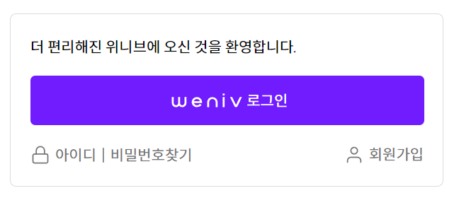

# ✨ 24-08-14 과제 [두근두근 비밀일기]
> 🛠 사용 기술스택 : HTML / CSS
## Dev history
- 피그마로 제안되어있는 디자인을 보고 HTML 마크업하는것 까지가 과제.
- 24.08.17 현재 할 수 있는 정도까지 CSS dev중. 추후 JS 등 지속적으로 develope예정

# ✨ 24-08-19 과제 [레이아웃 구현 프로젝트 -1 마크업]
> 🛠 사용 기술 스택 : HTML
## Dev history
- 영화목록페이지 구현하기
- HTML을 통해 시네마틱한 마크업진행해보기.
- CSS 및 JS를 배워 지속적으로 devlope할것

# ✨ 24-08-20 과제 [버튼구현]
>  🛠 사용 기술스택 : HTML / CSS
## Dev history
- :root 변수 사용하여 속성값 사용하는법 연습.
- button 태그를 사용하여 button의 상태가 normal, hover, active, disabled 일때의 상황을 고려하여 작성

# ✨ 24-08-21 과제 [로그인창 CSS]
> 🛠 사용 기술스택 : HTML / CS
## Dev history
- 기존 html수업시간때 마크업 해두었던 로그인창에 CSS입히기.
- 요소에 margin값을 주어 각 컴포넌트 배치
- 각 버튼에 들어가는 이미지는 디자인적 요소이므로 div값에 background-image삽입으로 처리
- :root를 이용한 컬러사용
